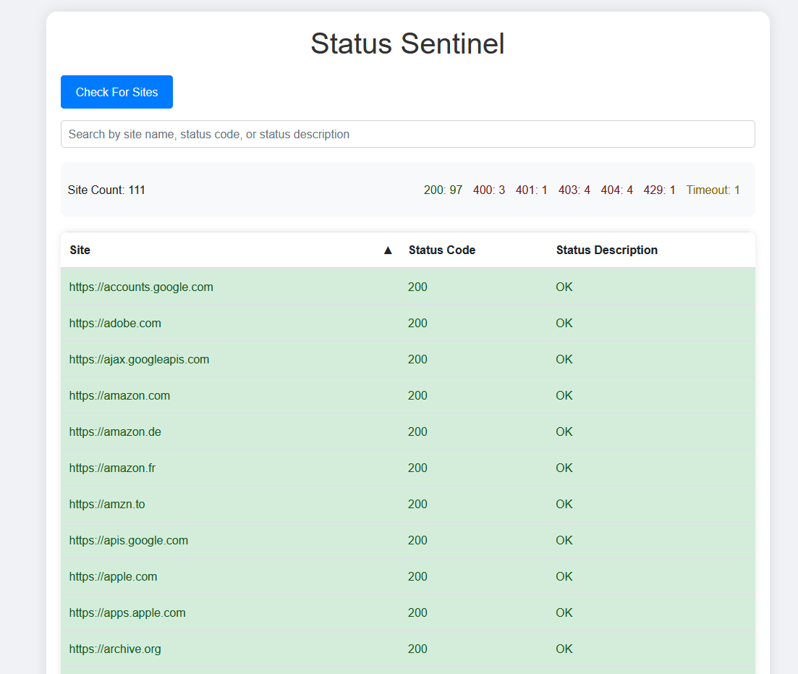

# Status Sentinel
## Overview

"Status Sentinel" is a Node.js application for real-time tracking of website availability

## Features
* 24/7 Monitoring: Continuous uptime tracking.

## Screenshots


## Requirements
* [Node.js](https://nodejs.org/en)
* NPM (Included with some Node.js installations)

## Installation
Clone the Repository
```sh
git clone https://github.com/AutumnNippert/Status-Sentinel.git
cd status-sentinel
```

## Install Dependencies
```sh
npm install
```

## Configure the Application
Run the Application
```sh
node app.js
```

## Contribution
To contribute, fork the repository, make your changes, and submit a pull request.

## License
This project is licensed under the MIT License. See the LICENSE file for details.
Contact